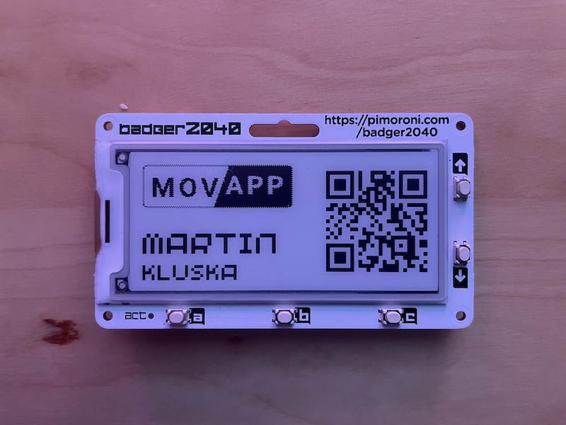

# MicroPython script for rendering a badge with QR Code, logo (image), and 2-line text on badger2040 microcontroller



The badger2040 is a small microcontroller board that can be used to create wearable badges or other small devices. This implementation allows users to create custom badges that include a QR code, logo/image, and two lines of text.

The code was created by combining the default badger2040 implementation of a badge with and QR code [example](https://github.com/pimoroni/pimoroni-pico/tree/main/micropython/examples/badger2040). In this repository, I have included my own personal badges that I'm currently using on my badger2040.

## Requirements

Before using this implementation, you will need to ensure that you have the following:

- A badger2040 board
- MicroPython installed on your computer
- The latest firmware installed on your badger2040 board

## Creating Your Own Badge

To create your own badge, follow these steps:

1. Create a new text file in the `badgeio` folder. For example, `badgeio/personal.txt`.
2. Add the following lines to the text file to set the badge:
   - An URL of a website to open
   - The first line of text
   - The second line of text
   - An optional path to an image you want to use
    ```txt
    https://kluska.cz
    MARTIN
    KLUSKA
    /badgeio/movapp.jpg
    ```
3. Add an image to the `badgeio` folder. I recommend using the same name as the text file. The image should be a JPEG with only two colors (black/white). For example, `badgeio/example.jpg`. <br><br> 

The implementation will ensure that the text is cut if it would be too long.

To navigate between badges, use the arrow buttons on your badger2040 board.

## Troubleshooting

If you encounter any issues with the implementation, try the following:

- Make sure you have followed all the steps correctly.
- Check that the image you are using is a JPEG with only two colors (black/white).
- Ensure that the text in your text file is not too long.

If you still encounter issues, you can try asking for help in the badger2040 community forums or here in issues.

## Installation

To install the implementation, follow these steps:

1. Copy the files from the `examples` folder to the `examples` folder on your badger2040 board.
2. Copy the `badgeio` folder to the root of your badger2040 board.

That's it! You should now be able to create and navigate between custom badges on your badger2040 board.
